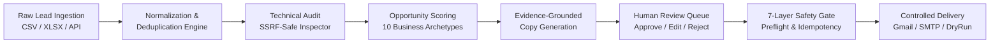
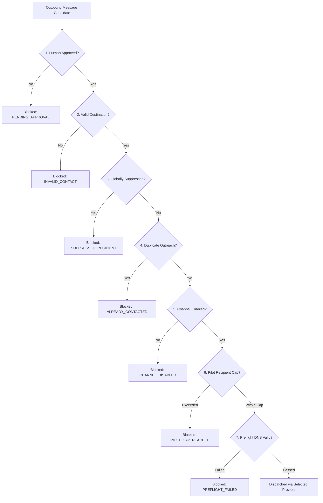

<div align="center">

# ⚡ LEAD INTELLIGENCE OS

**Autonomous B2B Lead Intelligence, Technical Auditing & Evidence-Grounded Outreach Engine**

[](https://nextjs.org/)
[](https://www.typescriptlang.org/)
[](https://www.postgresql.org/)
[](https://www.prisma.io/)
[](https://tailwindcss.com/)
[](https://vitest.dev/)

<p align="center">
  <a href="#-features">Features</a> •
  <a href="#-architecture">Architecture</a> •
  <a href="#-pipeline-flow">Pipeline Flow</a> •
  <a href="#-quick-start">Quick Start</a> •
  <a href="#-opportunity-engine">Opportunity Engine</a> •
  <a href="#-safety-gate">Safety Gate</a> •
  <a href="#-verification">Verification</a>
</p>

</div>

---

## 💡 Overview

**Lead Intelligence OS (LIO)** is an enterprise platform engineered for high-intent B2B commercial lead acquisition. Rather than blasting generic cold pitches, LIO automates deep technical footprint analysis on prospect companies, identifies real commercial vulnerabilities (unresponsive viewports, broken SSL, missing conversion funnels, unindexed portfolios), and generates precise, evidence-backed outreach tailored to business decision-makers.

---

## ✨ Features

- 🧠 **Offline-First Deterministic Rule Engine**: Pre-loaded with 10 opportunity archetypes and multi-tier scoring. Operates 100% offline without mandatory API keys.
- 🔬 **Deep Website Inspector**: Multi-page SSRF-safe crawling engine that fingerprints CMS platforms, JavaScript frameworks, contact forms, booking flows, and technical health signals.
- 🎯 **Dual-Scoring Algorithm**: Ranks leads by **Opportunity Score** (revenue potential) and **Confidence Score** (evidence certainty) to prevent low-yield outreach.
- 🛡️ **7-Layer Safety Gate**: Enforces DNS SPF/DKIM/DMARC preflight validation, SHA-256 idempotency locks, global suppression checks, duplicate throttling, and pilot recipient limits.
- ✉️ **Multi-Channel Dispatcher**: Native support for Gmail OAuth 2.0, SMTP, Resend, and dry-run simulation mode with transaction-safe audit logging.
- 📊 **Complete Command Center**: Next.js 15 App Router UI with dedicated pages for Dashboard KPIs, Lead profiles, CSV/XLSX import with deduplication previews, message review queues, and campaign pilots.

---

## 🏗️ Architecture

```
LEAD INTELLIGENCE OS (Monorepo)
├── apps/
│   └── web/                               # Next.js 15 Web Application & REST APIs
│       ├── app/                           # App Router (Dashboard, Leads, Messages, Pilot, Settings)
│       │   ├── api/                       # 25+ REST Endpoints (CRUD, Research, Pilot, Delivery)
│       │   ├── leads/                     # Directory, Profile Views, and CSV/XLSX Ingestion
│       │   ├── messages/                  # Message Approval & Editing Queue
│       │   ├── opportunities/             # Prioritized Opportunity Matrix
│       │   ├── pilot/                     # Safe Campaign Dispatch Console
│       │   └── settings/                  # Infrastructure Health & Suppression Lists
│       ├── lib/
│       │   ├── delivery/                  # Dispatcher, Safety Gate, Preflight, Providers
│       │   └── research/                  # SSRF-Safe Inspector & Evidence Fingerprinting
│       ├── scripts/                       # Simulator, Calibration & Report Scripts
│       └── tests/                         # Vitest Test Suite (59/59 passing)
├── packages/
│   ├── ai/                                # AI Provider Abstraction (Rule Engine, OpenAI, Gemini)
│   ├── database/                          # Prisma Schema, Normalizer, Deduplicator, Seeder
│   └── types/                             # Zod Schemas & TypeScript Definitions
├── infra/
│   └── docker/                            # Docker Compose for PostgreSQL 16
├── sample_data/                           # Verified Raw Lead Datasets (Dubai & UAE)
└── workflows/
    └── n8n/                               # Lead Research Workflow JSON
```

---

## 🔄 Pipeline Flow



---

## 🧩 Opportunity Engine (10 Built-in Archetypes)

The embedded rule engine accurately scores and generates custom pitch angles based on verified technical gaps:

| Archetype | Detection Criteria | Recommended Service | Pitch Focus |
|---|---|---|---|
| **Zero Web Presence** | Domain missing or unresolvable | Greenfield Web Presence | Inbound commercial discovery |
| **Broken Mobile UX** | Missing mobile viewport meta tag | Mobile-First Redesign | UAE mobile customer conversion |
| **Insecure / No SSL** | Plain HTTP without SSL | SSL & Security Hardening | Browser trust warnings & integrity |
| **Manual WhatsApp Trap** | wa.me links with no automation | 24/7 AI Qualification Bot | Off-hours customer capture |
| **Missing Conversion Funnel** | No enquiry form or booking widget | Lead Capture Funnels | Frictionless booking & enquiries |
| **Hidden Portfolio** | Projects/works link absent | High-Resolution Showcase | High-ticket buyer social proof |
| **No Clear Call to Action** | Page lacks primary action button | Conversion Rate Optimization | Immediate inquiry routing |
| **High Latency Server** | TTFB > 2.5 seconds | Cloud Migration & CDN | Client bounce rate mitigation |
| **Strong Modern Presence** | High score across all signals | *Do Not Contact* | Preserves sender domain reputation |
| **General Redesign** | Legacy tech stack detected | Modern Headless Stack | Performance and brand elevation |

---

## 🛡️ 7-Layer Safety Gate

Before any outbound message leaves the system, it must clear seven defensive checkpoints:



---

## ⚡ Quick Start

### Prerequisites
- **Node.js** 20+
- **pnpm** (`npm install -g pnpm`)
- **Docker Desktop** (for PostgreSQL)

### 1. Clone & Setup Environment
```bash
git clone https://github.com/Prithwiraj731/Lead-Intelligence-OS.git
cd Lead-Intelligence-OS
cp .env.example .env
```

### 2. Start PostgreSQL Container
```powershell
cd infra/docker
docker compose up -d
cd ../..
```

### 3. Install & Seed Database
```powershell
pnpm install
pnpm db:generate
pnpm db:push
pnpm db:seed
```

### 4. Run Development Server
```powershell
pnpm dev
# Open http://localhost:3000
```

---

## 🧪 Verification & Testing

Every package and module in the monorepo includes comprehensive test coverage:

```powershell
# Run the 59 unit & integration tests
pnpm test

# Verify zero TypeScript compilation errors
pnpm -r exec tsc --noEmit

# Run the 10-archetype rule calibration test
pnpm --filter @leadintel/web exec tsx scripts/run-calibration-scenarios.ts

# Run the end-to-end campaign simulator
pnpm --filter @leadintel/web exec tsx scripts/run-campaign-simulation.ts

# Production build verification
pnpm build
```

---

## 🔌 API Reference Summary

| Endpoint | Method | Description |
|---|---|---|
| `/api/health` | `GET` | System uptime, database latency & service status |
| `/api/metrics` | `GET` | Dashboard KPIs, conversion funnel, and volume stats |
| `/api/leads` | `GET`, `POST` | List leads with pagination, search, or create new |
| `/api/leads/[id]` | `GET`, `PATCH` | Retrieve full company profile, research, and messages |
| `/api/leads/[id]/research` | `POST` | Run live SSRF-safe audit & opportunity discovery |
| `/api/leads/[id]/generate-message` | `POST` | Generate evidence-grounded personalized copy |
| `/api/leads/import/preview` | `POST` | Parse CSV/XLSX and preview deduplication results |
| `/api/leads/import` | `POST` | Commit imported leads to PostgreSQL |
| `/api/messages` | `GET` | Filter message queue by channel, status, and lead |
| `/api/messages/[id]/approve` | `POST` | Approve message for scheduled or pilot delivery |
| `/api/messages/[id]/deliver` | `POST` | Dispatch message through safety gate |
| `/api/pilot/leads` | `GET` | Retrieve approved leads ready for pilot dispatch |
| `/api/pilot/deliver` | `POST` | Execute controlled pilot dispatch |
| `/api/delivery/preflight` | `POST` | Run 11 infrastructure checks including SPF/DKIM |
| `/api/delivery/suppressions` | `GET`, `POST` | Manage global suppression list |

---

## 📄 License

Distributed under the MIT License. See `LICENSE` for details.
